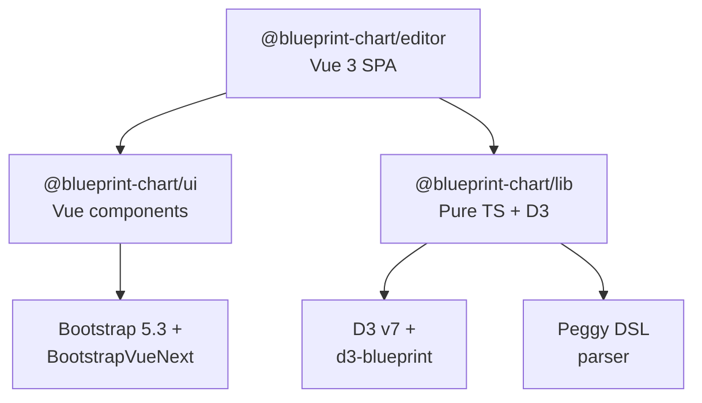

<p align="center">
  <a href="https://blueprintchart.com" align="center">
    
  </a>
</p>
<p align="center"><strong>DSL-driven interactive charting library and Vue 3 editor designed for newsroom storytelling — composable, accessible, and scene-driven.</strong></p>

<div align="center">

|      | Status |
| ---: | :--- |
| **CI checks** | [](https://github.com/blueprint-chart/blueprint-chart/actions/workflows/ci.yml) |
| **Latest version** | [](https://github.com/blueprint-chart/blueprint-chart/releases/latest) |
|   **Release date** | [](https://github.com/blueprint-chart/blueprint-chart/releases/latest) |
|    **Open issues** | [](https://github.com/blueprint-chart/blueprint-chart/issues/) |
|  **Websites** | [](https://blueprintchart.com) |

</div>

Blueprint Chart lets journalists and developers author **interactive, accessible, narrative-driven charts** from a compact DSL (`.bpc`). Charts are first-class **stories**: every chart can define multiple **scenes** (named data/config states) that play back as an animated sequence.

## Architecture

Three packages in a pnpm 10 workspace, wired together via `workspace:*` refs:



`ui` does **not** depend on `lib`; the editor is the only consumer that composes both. Each package is independently usable and testable.

## Packages

<table>
<thead><tr><th>Package</th><th>Role</th></tr></thead>
<tbody>
<tr><td nowrap><a href="https://www.npmjs.com/package/@blueprint-chart/lib"><code>@blueprint-chart/lib</code></a></td><td>Pure TypeScript + D3 chart engine and Peggy DSL parser. Ships an ESM entry and a standalone IIFE runtime for framework-free embeds.</td></tr>
<tr><td nowrap><a href="https://www.npmjs.com/package/@blueprint-chart/ui"><code>@blueprint-chart/ui</code></a></td><td>Vue 3 component library (~109 components: forms, panels, navigation, scene timeline, layout). Bootstrap + BootstrapVueNext, with Histoire stories.</td></tr>
<tr><td nowrap><a href="https://www.npmjs.com/package/@blueprint-chart/editor"><code>@blueprint-chart/editor</code></a></td><td>Vue 3 SPA composing <code>lib</code> + <code>ui</code> into the authoring experience: live CodeMirror 6 DSL editor, Pinia stores, scene playback, export.</td></tr>
</tbody>
</table>

## Prerequisites

- **Node 22** (matches CI)
- **pnpm 10** — `corepack enable` picks the pinned version
- Git

## Installation

```bash
git clone git@github.com:blueprint-chart/blueprint-chart.git blueprint-chart
cd blueprint-chart
make install
```

`make install` runs `pnpm install` **and** `make build-parser`, which compiles the Peggy grammar into `packages/lib/src/dsl/grammar.js`. The generated file is checked into git, so fresh clones work immediately.

> The Makefile is the canonical entry point — prefer `make <target>` over raw `pnpm` so CI and local runs stay aligned. Run `make help` for the full list.

## Running

### Editor (SPA)

```bash
make dev
```

Boots the editor on **http://localhost:5555**. Vite handles HMR for the editor, `ui`, and `lib` in one go thanks to the pnpm workspace.

### Component stories

```bash
make dev-story
```

Histoire serves `packages/ui` stories on **http://localhost:4444**. Every `*.story.vue` file is auto-discovered.

### Tests

```bash
make test          # Vitest unit tests across all packages
make test-watch    # Vitest in watch mode
make test-e2e      # Playwright chromium against a live dev server
```

### Lint

```bash
make lint          # report only
make lint-fix      # auto-fix
```

### Production builds

```bash
make build         # build all packages
make build-lib     # only lib (ES + IIFE runtime)
make build-editor  # only the editor SPA
make build-story   # static Histoire site
make preview       # preview production editor build
```

## Common gotchas

- If you edit `packages/lib/src/dsl/grammar.peggy`, re-run `make build-parser` (or `make install`) to regenerate `grammar.js`.
- If tests start failing right after a `git pull`, run `make install` once — a changed grammar or lockfile is the usual cause.
- The editor dev server runs on **5555** (also Playwright's `baseURL`). Histoire runs on **4444**.

## Further reading

- `AGENTS.md` — coding conventions and contribution guidelines
- `RELEASING.md` — release process and versioning
- `docs/` — additional documentation

## License

See `LICENSE`.
