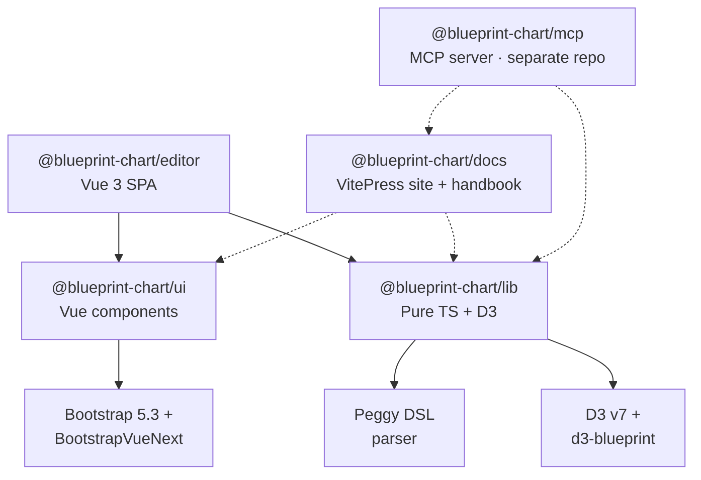

<p align="center">
  <a href="https://blueprintchart.com" align="center">
    
  </a>
</p>
<p align="center"><strong>An open, plain-text chart format an AI can write and any browser can render. Self-contained, no backend, no account required.</strong></p>

<p align="center">
  <a href="https://blueprintchart.com"><strong>Try the live editor →</strong></a>&nbsp;&nbsp;·&nbsp;&nbsp;<a href="https://docs.blueprintchart.com">Docs</a>&nbsp;&nbsp;·&nbsp;&nbsp;<a href="#author-with-ai">Make charts with AI</a>
</p>

<p align="center">
  
</p>

Write a chart in plain text:

```bpc
chart bar-vertical {
  title = "A chart in four lines"
  data {
    "Plain text" = 92
    "No backend" = 88
    "No account" = 95
  }
}
```

…or let an AI assistant write it for you:

```bash
claude mcp add blueprint-chart -- npx -y @blueprint-chart/mcp
```

<div align="center">

|      | Status |
| ---: | :--- |
| **CI checks** | [](https://github.com/blueprint-chart/blueprint-chart/actions/workflows/ci.yml) |
| **Latest version** | [](https://github.com/blueprint-chart/blueprint-chart/releases/latest) |
|   **Release date** | [](https://github.com/blueprint-chart/blueprint-chart/releases/latest) |
|    **Open issues** | [](https://github.com/blueprint-chart/blueprint-chart/issues/) |
|  **Websites** | [](https://blueprintchart.com) [](https://docs.blueprintchart.com) |

</div>

Blueprint Chart lets developers, AI assistants, and journalists author **interactive, accessible charts** from a compact, plain-text DSL (`.bpc`) — emitted by an LLM or written by hand, and rendered anywhere with no backend. Charts are first-class **stories**: every chart can define multiple **scenes** (named data/config states) that play back as an animated sequence.

## Architecture

Four packages in a pnpm 10 workspace, wired together via `workspace:*` refs — plus a separate [`@blueprint-chart/mcp`](https://github.com/blueprint-chart/mcp) server (shown dashed) that consumes the published `lib` + `docs`:



`ui` does **not** depend on `lib`; the editor is the only consumer that composes both. `docs` consumes `lib` and `ui` at build time (for the API reference and live samples) but ships its handbook and guides as plain markdown so any tool can re-render them. Each package is independently usable and testable.

## Packages

<table>
<thead><tr><th>Package</th><th>Role</th></tr></thead>
<tbody>
<tr><td><a href="https://www.npmjs.com/package/@blueprint-chart/lib"><code>@blueprint&#8209;chart&#8288;/&#8288;lib</code></a></td><td>Pure TypeScript + D3 chart engine and Peggy DSL parser. Ships an ESM entry and a standalone IIFE runtime for framework-free embeds.</td></tr>
<tr><td><a href="https://www.npmjs.com/package/@blueprint-chart/ui"><code>@blueprint&#8209;chart&#8288;/&#8288;ui</code></a></td><td>Vue 3 component library (~109 components: forms, panels, navigation, scene timeline, layout). Bootstrap + BootstrapVueNext, with Histoire stories.</td></tr>
<tr><td><a href="https://www.npmjs.com/package/@blueprint-chart/editor"><code>@blueprint&#8209;chart&#8288;/&#8288;editor</code></a></td><td>Vue 3 SPA composing <code>lib</code> + <code>ui</code> into the authoring experience: live CodeMirror 6 DSL editor, Pinia stores, scene playback, export.</td></tr>
<tr><td><a href="https://www.npmjs.com/package/@blueprint-chart/docs"><code>@blueprint&#8209;chart&#8288;/&#8288;docs</code></a></td><td>Public documentation — handbook, guide, BPC DSL spec, and lib API reference. Ships a VitePress site (<a href="https://docs.blueprintchart.com">docs.blueprintchart.com</a>) and a programmatic <code>listDocs</code> / <code>getDoc</code> API + <code>manifest.json</code> for tooling such as <code>@blueprint-chart/mcp</code>.</td></tr>
<tr><td><a href="https://github.com/blueprint-chart/mcp"><code>@blueprint&#8209;chart&#8288;/&#8288;mcp</code></a></td><td><strong>Separate repo.</strong> Model Context Protocol server that lets LLM clients (Claude, Claude Code, Cursor) author <code>.bpc</code> files — grounded in the dataviz handbook with eight deterministic tools and a parse + render feedback loop. Consumes the published <code>lib</code> + <code>docs</code>. <a href="https://www.npmjs.com/package/@blueprint-chart/mcp">npm</a></td></tr>
</tbody>
</table>

## Author with AI

[`@blueprint-chart/mcp`](https://github.com/blueprint-chart/mcp) lets you make charts by chatting with an AI assistant. It exposes the dataviz handbook, the DSL grammar, chart-type docs, and canonical samples as MCP resources, plus eight deterministic tools (`validate_dsl`, `inspect_dsl`, `recommend_chart_type`, `render`, …). Your assistant reads the handbook, writes the `.bpc`, validates it, and renders it — a tight feedback loop instead of guesswork.

```bash
claude mcp add blueprint-chart -- npx -y @blueprint-chart/mcp
```

Copy-paste setup for every client (Claude Code, Claude Desktop, Cursor, Windsurf, Cline, VS Code) lives in the [**Authoring with AI** guide](https://docs.blueprintchart.com/guide/mcp); the complete tool reference is in the [MCP repo](https://github.com/blueprint-chart/mcp).

## Prerequisites

- **Node 22** (matches CI)
- **pnpm 10** — `corepack enable` picks the pinned version
- Git

## Installation

```bash
git clone git@github.com:blueprint-chart/blueprint-chart.git blueprint-chart
cd blueprint-chart
make install
```

`make install` runs `pnpm install` **and** `make build-parser`, which compiles the Peggy grammar into `packages/lib/src/dsl/grammar.js`. The generated file is checked into git, so fresh clones work immediately.

> The Makefile is the canonical entry point — prefer `make <target>` over raw `pnpm` so CI and local runs stay aligned. Run `make help` for the full list.

## Running

### Editor (SPA)

```bash
make dev
```

Boots the editor on **http://localhost:5555**. Vite handles HMR for the editor, `ui`, and `lib` in one go thanks to the pnpm workspace.

### Component stories

```bash
make dev-story
```

Histoire serves `packages/ui` stories on **http://localhost:4444**. Every `*.story.vue` file is auto-discovered.

### Docs site

```bash
make dev-docs
```

VitePress serves the handbook, guide, DSL spec, and lib API reference from `packages/docs/src/` on **http://localhost:4445**. The same markdown is shipped in the published `@blueprint-chart/docs` package and consumed programmatically by tools like `@blueprint-chart/mcp`.

### Tests

```bash
make test          # Vitest unit tests across all packages
make test-watch    # Vitest in watch mode
make test-e2e      # Playwright chromium against a live dev server
```

### Lint

```bash
make lint          # report only
make lint-fix      # auto-fix
```

### Production builds

```bash
make build         # build all packages
make build-lib     # only lib (ES + IIFE runtime)
make build-editor  # only the editor SPA
make build-story   # static Histoire site
make build-docs    # static VitePress docs site (+ manifest.json + api.d.ts)
make preview       # preview production editor build
```

## Common gotchas

- If you edit `packages/lib/src/dsl/grammar.peggy`, re-run `make build-parser` (or `make install`) to regenerate `grammar.js`.
- If tests start failing right after a `git pull`, run `make install` once — a changed grammar or lockfile is the usual cause.
- The editor dev server runs on **5555** (also Playwright's `baseURL`). Histoire runs on **4444**. The docs site runs on **4445**.

## Further reading

- `AGENTS.md` — coding conventions and contribution guidelines
- `RELEASING.md` — release process and versioning
- `docs/` — additional documentation

## License

See `LICENSE`.
